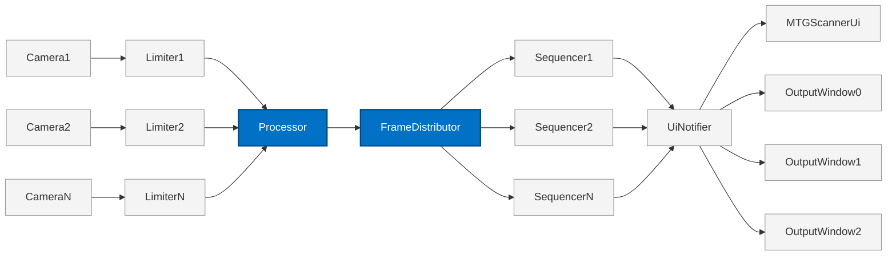

```mermaid

flowchart LR

    classDef serial fill:#f4f4f4,stroke:#999,stroke-width:1px,color:#333
    classDef unlimited fill:#0071c5,stroke:#004a86,stroke-width:2px,color:#fff

    Camera1:::serial --> Limiter1:::serial
    Camera2:::serial --> Limiter2:::serial
    CameraN:::serial --> LimiterN:::serial

    Limiter1 --> Processor
    Limiter2 --> Processor
    LimiterN --> Processor

    Processor[Processor]:::unlimited --> FrameDistributor[FrameDistributor]:::unlimited

    FrameDistributor --> Sequencer1:::serial
    FrameDistributor --> Sequencer2:::serial
    FrameDistributor --> SequencerN:::serial

    Sequencer1 --> UiNotifier:::serial
    Sequencer2 --> UiNotifier
    SequencerN --> UiNotifier

    UiNotifier --> MTGScannerUi:::serial
    UiNotifier --> OutputWindow0:::serial
    UiNotifier --> OutputWindow1:::serial
    UiNotifier --> OutputWindow2:::serial

    %%subgraph Legend
    %%    direction TD
    %%    L1[tbb::flow::serial]:::serial
    %%    L2[tbb::flow::unlimited]:::unlimited
    %%end

```

The blue ones are `tbb::flow::unlimited` while the rest are `tbb::flow::serial`.