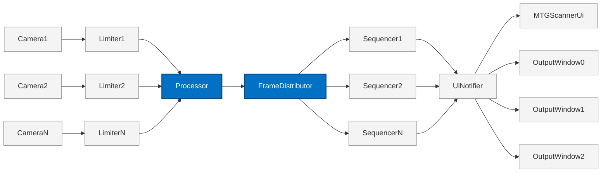

# MTGSCanner
MTGScanner is a cross-platform Magic The Gathering card detector, that captures video stream from 4 or more cameras, detects the cards, tracks them, extracts their nameplates and displays them on their output windows, which can then be captured by streaming tools like OBS Studio. Basically, a tool to capture the cards drawn by 4 people in a MTG table-top game, while you are streaming. The idea was proposed by a client.

## Usage
To use MTGScanner, you need to make sure your cameras are connected to your computer. MTGScanner uses Qt Multimedia, meaning whatever camera type is supported by Qt Multimedia should work just fine. Once you launch the application:

* Click on **Add Channel**, select a camera, preview the camera output, and click **Next**.
* Set **Channel Name** and Detection settings (if any), then click **Next**.
* Configure Output Window by setting options. Default **Window Name** is `<channel_name> Out`, set position geometry, and set **Target Monitor** on which the window should appear on. In case of my client, he wanted to use virtual displays. At last, click **Create Channel**.

You should have a basic channel setup. Main Dashboard preview will display a scanned stream preview, camera and output window information, and metrics at the bottom. You can **Start/Stop** each channel by clicking the play/pause button.

> [!TIP]  
> Never bring the whole deck in front of the camera, instead:
>   * Bring cards one by one. *Helps avoid false positives during tracking.*
>   * Keep the card in the palm of your hand or on the table with little to no overlapping objects on the card. *Helps with proper pose-estimation.*
>   * Move them out in different directions, if possible. But you don't need to, if you're scanning cards with 2-5 seconds gap in between. *Helps the tracker forget older cards.*

> [!NOTE]
> * If you **plug-out a camera** while it is being used by MTGScanner and plug it back in, the Channel may already be corrupt. This behavior is imposed by how different Operating Systems handle input devices, not MTGScanner. It may try to recover the same camera, if you plug-in the camera through the same port and restart the application. But there's no gaurantee the camera will have similar properties, hence a different camera.
> * If you **accidently close an output window**, you can launch it again using the re-launch button in the **Output Window** information card.
> * If you want to **change the current configuration**, you have to delete the channel and add it again.
> * **No camera can be reused while its active**. This is also imposed by the OS, not MTGScanner.

## Features
Includes but are not limited to:

* Channel based setup.
* Customizable output windows.
* Safe against sudden plug-ins and plug-outs.
* Allows stopping/starting of Channels.
* Live metrics.
* Live camera preview during selection.
* Testing using `.mp4` files, in debug mode.
* Track cards to avoid duplication.
* Perspective crops over basic crops.
* Replaces older low-res nameplates crops with better-res crops when necessary.

## Architecture
### TBB Graph



The blue ones are `tbb::flow::unlimited` and the rest are `tbb::flow::serial`.

## Build From Source
### Prerequisites
To build this project, you need:

#### Tools
* **GCC 15 or MSVC 18**
* **CMake 4.2.3**
* **CMake Generator (i.e. Ninja)**
* **VCPKG**

#### Dependencies
* **Qt 6.11.1**
* **ONNXRuntime v1.22**
* **OpenCV 4.10.0**
* **TBB 2022.3.0**
* **Yaml-cpp 0.8.0**
* **ByteTrack-cpp**
* **Eigen3** (for ByteTrack-cpp)

> [!NOTE]
> 1. The versions specified here are my current installations and I don't know if it should work with earlier versions. *Qt 6.10* had a major GC bug, so I'd watch out for that.
> 2. You can build without VCPKG, if you've custom builds for the [packages](vcpkg.json). You've to set `<package>_DIR` for each package in that case, during configuration.
> 3. Qt and ONNXRuntime aren't part of VCPKG packages because of their size and time-consuming builds. You're free to install them however you want, through VCPKG, package managers, Qt Online Installer, custom binaries, etc. However, a default ONNXRuntime build (from release assets) will be downloaded/used, if you don't provide/set `onnxruntime_ROOT` or `onnxruntime_DIR`.
> 4. You can have your own ONNXRuntime build with any Execution Provider or simply paste binaries provided by the maintainers (e.g. [OpenVINO EP](https://onnxruntime.ai/docs/execution-providers/OpenVINO-ExecutionProvider.html#install)) alongside ONNXRuntime binaries. But MTGScanner only recognizes CPU and OpenVINO EPs at the moment. I don't have a dedicated GPU. But it is **highly** recommended to have OpenVINO or any other EP, because CPU only will overload the system and starve the application, resulting in unwanted behavior.
> 5. ByteTrack-cpp is a submodule and requires Eigen3 to work. So, make sure you use the `--recursive` option when cloning.

#### The Model
This project uses a custom trained **YOLO11n-pose** model. It'll be provided in each release and must be copied relative to the binary directory `<bin_dir>/assets/models/yolo11n-pose.onnx` or you can also put it in the source directory's `assets/models` directory and CMake will take care of the copy.

The Pose Estimation dataset (of 285 images) contains images from the internet, taken by collectors using their phones and some from a youtube video. I'm expanding the dataset continously and will soon be available on patreon or something.

> [!WARNING]
> As of now, the application expects this model with the exact number of classes (i.e. `card_front`, `title` and `card_back`) and output layout, for performance reasons. The behavior is unknown, in case of any other model.

#### Build from Source
Open Terminal or `x64 Native Tools Command Prompt for VS` and `cd` directory somewhere and do:

```bash
# Clone the project
git clone --recursive https://github.com/ahsanullah-8bit/MTGScanner.git
cd MTGScanner

# Configure
cmake -S . -B build -G "Ninja" -DCMAKE_BUILD_TYPE=Release -DCMAKE_TOOLCHAIN_FILE=<vcpkg_root>/scripts/buildsystems/vcpkg.cmake -DVCPKG_MANIFEST_MODE=ON -DVCPKG_BOOTSTRAP_OPTIONS=--shallow -DQT_QMAKE_EXECUTABLE=<qt_root>/<version>/<kit>/bin/qmake.exe

# Build
cmake --build build
```

Replace the `<...>` with proper paths. If Qt is still missing, you can also use `-DVCPKG_CHAINLOAD_TOOLCHAIN_FILE=<qt_root>/<version>/<kit>/lib/cmake/Qt6/qt.toolchain.cmake`, when using VCPKG.

> [!NOTE]  
> Building in Debug mode (i.e. `-DCMAKE_BUILD_TYPE=Debug`) allows you to use a video file `<bin_dir>/assets/videos/demo.mp4` for debugging. The name must be `demo.mp4` and must be located at the exact path or you can put it in the source directory's `assets/videos` directory and CMake will copy it to the right place. If the file is missing or have a different path, the application will ignore it.